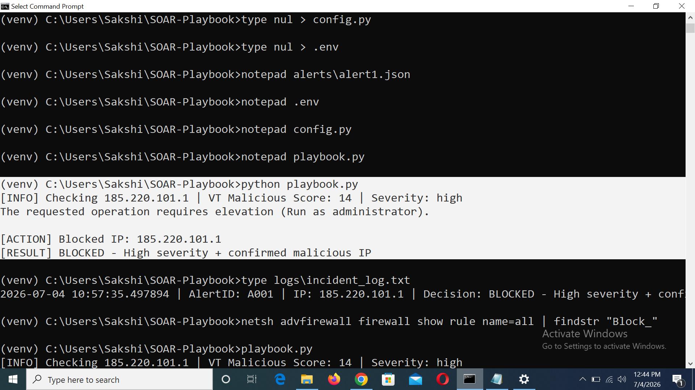
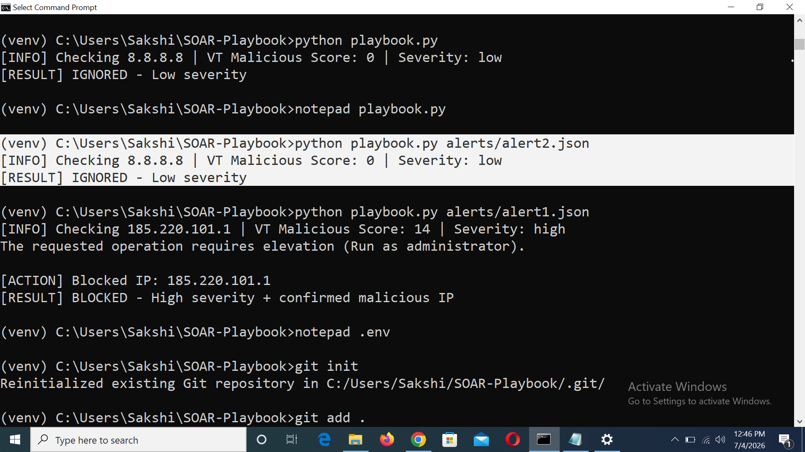
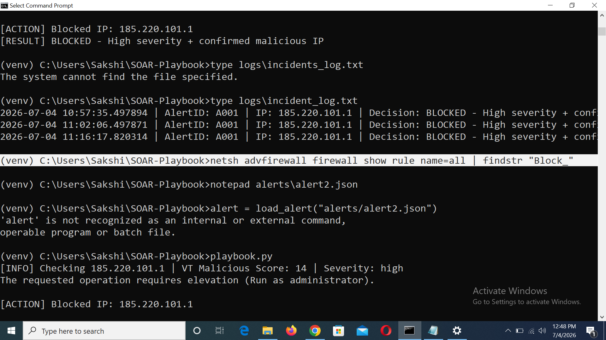
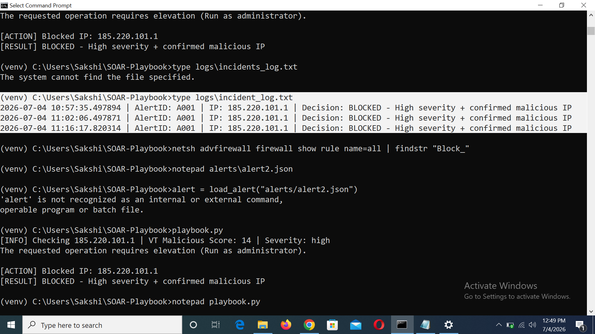

# SOAR Playbook - Automated Incident Response

A Python-based Security Orchestration, Automation and Response (SOAR) tool that automatically triages security alerts, enriches indicators using threat intelligence, and executes real-time response actions like IP blocking.

## Problem Statement

SOC analysts face alert fatigue from manually triaging hundreds of daily security alerts, leading to slower response times and missed threats. This project automates the triage and initial response process, reducing manual workload and response time.

## Architecture

Alert (JSON) -> IP Enrichment (VirusTotal API) -> Severity Triage -> Automated Action -> Logging

## Features

- Ingests security alerts (simulated as JSON, similar to SIEM output)
- Enriches source IPs using the VirusTotal API for reputation scoring
- Auto-triages alerts based on severity + threat intelligence score
- Automatically blocks malicious IPs via Windows Firewall
- Logs every incident and decision for audit purposes
- (Optional) Sends real-time notifications to Discord

## Tools & Technologies

- Python 3
- VirusTotal API (threat intelligence enrichment)
- Windows Firewall (netsh) for automated blocking
- python-dotenv for secure credential management

## How It Works

1. An alert is loaded (e.g., a brute force attempt from a source IP)
2. The source IP is checked against VirusTotal's reputation database
3. Based on severity and malicious score, the system decides:
   - **Block** - high severity + confirmed malicious IP
   - **Escalate** - high severity but unclear reputation
   - **Ignore** - low severity, no action needed
4. Every decision is logged with a timestamp for auditing

## Sample Output

```
[INFO] Checking 185.220.101.1 | VT Malicious Score: 8 | Severity: high
[ACTION] Blocked IP: 185.220.101.1
[RESULT] BLOCKED - High severity + confirmed malicious IP
```

## Setup & Usage

1. Clone this repo:
   ```
   git clone https://github.com/sakshigund127/SOAR-Playbook.git
   cd SOAR-Playbook
   ```

2. Create a virtual environment and install dependencies:
   ```
   python -m venv venv
   venv\Scripts\activate
   pip install requests python-dotenv
   ```

3. Add your own VirusTotal API key in a `.env` file:
   ```
   VT_API_KEY=your_api_key_here
   ```

4. Run the playbook:
   ```
   python playbook.py alerts/alert1.json
   ```

## MITRE ATT&CK Mapping

- **T1110 - Brute Force**: detected and auto-blocked based on high severity + malicious IP reputation

## What I Learned

- Building automation logic for security decision-making
- Working with threat intelligence APIs
- Secure credential handling using environment variables
- Using Windows Firewall automation via command-line tools
- Git/GitHub version control, including recovering from an accidental API key exposure by rotating the key and cleaning the repository

## Future Improvements

- Integrate multiple threat intel sources (AbuseIPDB, Shodan)
- Add Discord/Slack real-time notifications
- Support Linux (iptables) in addition to Windows Firewall
- Build a simple web dashboard for viewing incident logs

## Screenshots
## Screenshots

### High severity alert - IP blocked


### Low severity alert - correctly ignored


### Firewall rule created automatically


### Incident log for auditing

